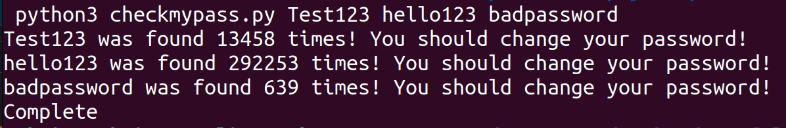

# Password-Hack-Checker

> This project allows the user to input their password and determine how secure it is.
> It checks the password utilising SHA1 hashing and an API to check how many times that password has been hacked.
> The user inputs the passwords they would like checking separated by a space character.
> The output displays a message stating if the password is secure or if it is recommended to change it.
> The output also states how many times the password has been used for clarity for the user.
>
> The screenshot below shows an example of 3 checked passwords : 
>
> 
